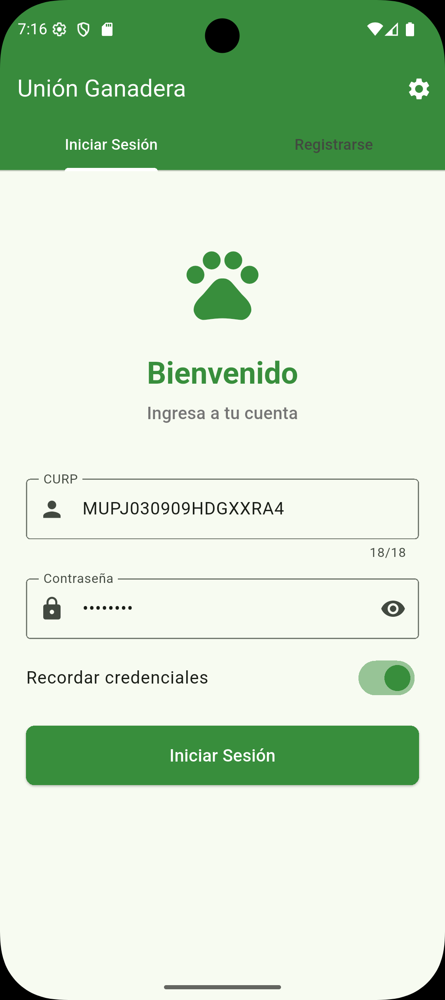
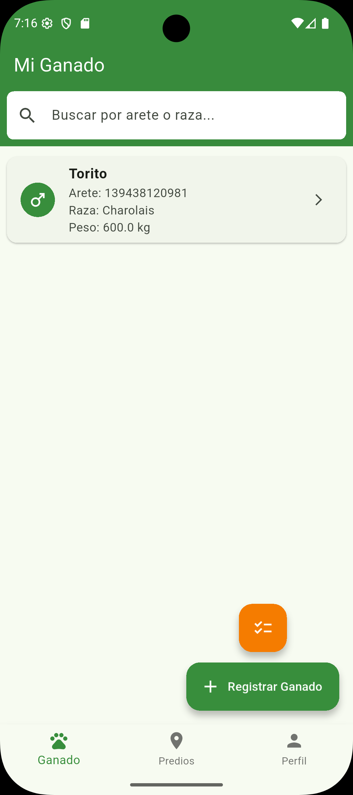
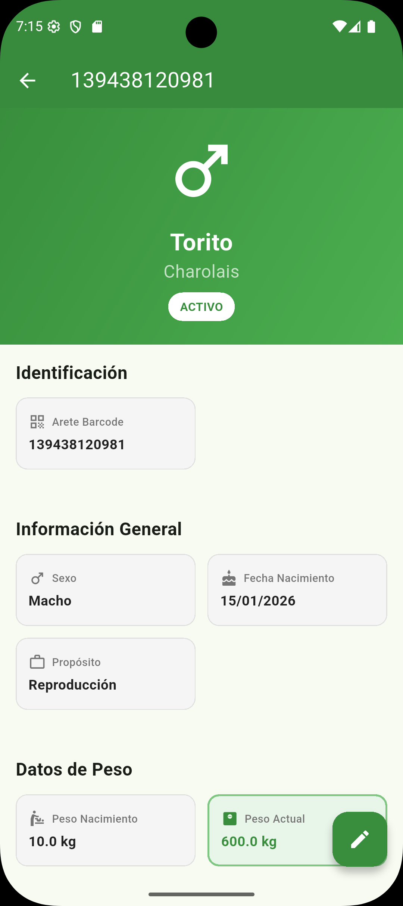
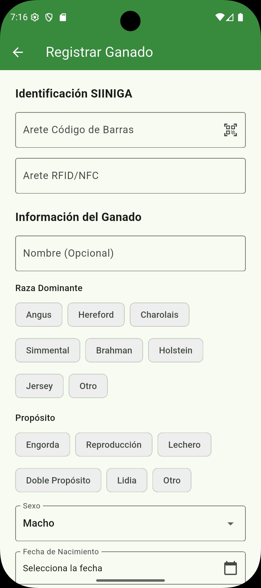
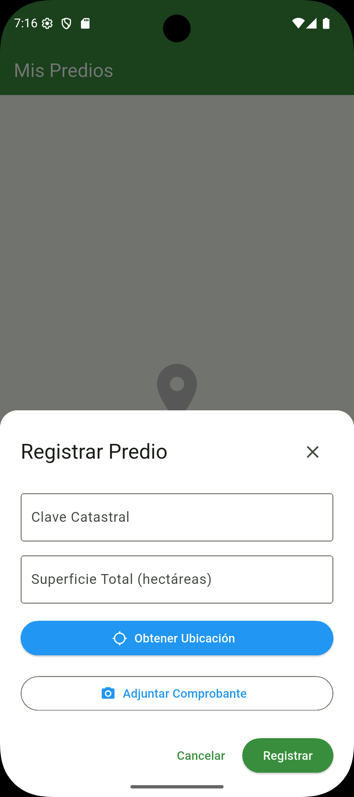
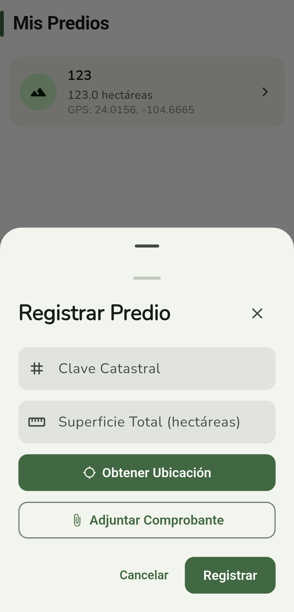

# MUU-NITOREO (Unión Ganadera App)

Aplicación móvil desarrollada en Flutter para la gestión integral de ganado, predios y eventos ganaderos de la Unión Ganadera.

## 🔗 Repositorios

Este proyecto es parte de un ecosistema más grande. Revisa los otros repositorios de sus componentes:

- **Backend API**: [union_ganadera_api](https://github.com/jorgemp1270/union_ganadera_api)

## 📋 Descripción

Esta aplicación permite a los **ganaderos y veterinarios** registrar y gestionar su ganado, predios y eventos relacionados con la actividad ganadera. Incluye funcionalidades avanzadas como lectura de códigos de barras, NFC, captura de ubicación GPS, carga de documentos, visualización de mapas y una interfaz renovada con **Material 3 Expressive** y fuente **Nunito**.

<p align="center">
  
  
  
</p>

<p align="center">
  
  
  
</p>

## ✨ Características

### Autenticación de Usuarios
- Interfaz unificada con **tabs segmentados en forma de píldora** (Iniciar Sesión / Registrarse)
- **Asistente de registro multi-paso** con barra de progreso visual — 3 pasos para ganaderos, 4 para veterinarios:
  - Paso 1 — **INE Frente** (obligatorio): captura con cámara; lectura automática de OCR extrae nombre, CURP y otros datos
  - Paso 2 — **INE Reverso** (opcional): puede omitirse; OCR extrae domicilio y CURP del reverso si está disponible
  - Paso 3 (solo veterinarios) — **Cédula Profesional**: captura de cédula; los campos se pueden cargar desde OCR
  - Último paso — **Contraseña**: campos de CURP/contraseña pre-rellenados por OCR, editables antes de enviar
- OCR automático al capturar cada documento (`OcrUtil.scanIneFront` / `scanIneBack` / `scanCedula`)
- Autenticación JWT con manejo automático de sesiones
- Guardado opcional de credenciales
- Configuración de API personalizable (IP y puerto) desde el ícono de engranaje
- Cierre de sesión automático ante respuestas 401 (no autenticado)
- Validación de contraseña con límite de 72 caracteres
- **Carga de INE al registro:** frente obligatorio y reverso opcional (los dos documentos separados — `identificacion_frente` / `identificacion_reverso`)

### Gestión de Ganado
- **Registro de ganado:**
  - Escaneo de código de barras o tag NFC
  - Captura de foto de la nariz del animal para identificación biométrica
  - Selección de raza dominante mediante botones (8 opciones + "Otro")
  - Selección de propósito mediante botones (6 opciones + "Otro")
  - Selección de status mediante botones (7 opciones + "Otro")
  - Campos para identificación de madre, padre y predio de origen
  - **Selector de predio:** dropdown con clave catastral, superfície y coordenadas GPS del predio
  - **Sección Genealogía:** dropdowns para seleccionar **madre** (hembras) y **padre** (machos) del padrón de bovinos del usuario
- **Consulta de ganado:**
  - Vista detallada con diseño de cuadrícula organizada
  - Información estructurada en bloques: Identificación, Información General, Datos de Peso
  - Encabezado con gradiente y badge de status
  - **Avatar biométrico:** muestra la foto de nariz desde `nariz_url` si está disponible; cae al ícono de género si no
  - **Tarjeta de foto biométrica:** imagen a ancho completo con gradiente de acción — toca para ampliar en pantalla completa con `InteractiveViewer`
  - **Folio:** mostrado con destacado visual en la sección de Identificación cuando está disponible
  - **Sección Genealogía:** tarjetas de madre y padre (toca para navegar al detalle del progenitor)
  - **Genealogía con proyección mínima (bovinos adquiridos):** si el progenitor pertenece a otro ganadero tras una compraventa, se muestra una **tarjeta de solo lectura** con los datos públicos disponibles (folio, raza dominante, fecha de nacimiento, sexo) — con ícono de candado y sin navegación al detalle del progenitor
  - **Chip de estatus con color:** en la lista de ganado, el estatus se muestra con código de color — verde (`activo`), naranja (`en tratamiento`), rojo (`muerto`), gris (`inactivo` / otros)
- **Edición de ganado:**
  - Botón flotante de edición en la vista detallada
  - Interfaz idéntica al registro con datos pre-cargados
  - **Selector de predio en edición:** permite asignar o cambiar el predio del animal (incluye la opción "Sin predio")
  - **Sección Genealogía en edición:** madre y padre pre-cargados desde el bovino existente
- **Selección múltiple:**
  - Mantén presionado cualquier animal para activar el modo de selección
  - Checkboxes para seleccionar múltiples animales
  - Registro de eventos masivos para todos los seleccionados simultáneamente
- **Historial de eventos:**
  - Visualización en línea de tiempo por tipo de evento
  - Detalles de peso mostrando peso nuevo y peso anterior
  - **Tratamientos vinculados a enfermedad:** si un tratamiento está ligado a un evento de enfermedad, se muestra una tarjeta expandida con el tipo de enfermedad, fecha de detección y observaciones en estilo destacado naranja
  - **Remisiones (altas médicas):** cada evento de remisión muestra una tarjeta expandida en verde con la enfermedad resuelta, su fecha de detección y observaciones — estilo visual paralelo al de tratamientos

### Gestión de Predios
- Registro de predios con captura de ubicación GPS automática
- Modal bottom sheet optimizado para móviles (reemplaza diálogos)
- **Carga de documentos ampliada:** cámara, galería de fotos _y_ selector de archivos (PDF, etc.) vía `file_picker`
- **Documento de comprobante vinculado al predio** usando el endpoint `POST /predios/{predio_id}/upload-document` (clave S3 con scope de predio)
- Predios **directamente asociados al usuario** — ya no dependen de un domicilio
- Navegación al detalle de cada predio al tocar el ítem en la lista
- Lista y detalles de predios registrados
- Manejo adaptativo de teclado en formularios

### Registro de Eventos

Los eventos disponibles dependen del **rol del usuario**:

**Todos los usuarios:**
- `peso` — Registro de peso con historial del peso anterior
- `dieta` — Cambio de tipo de alimento
- `compraventa` — Transferencia de propiedad: el **vendedor se asigna automáticamente** al usuario autenticado (tarjeta bloqueada, no editable); solo se ingresa la CURP del comprador. La API rechaza (`403`) si `vendedor_curp` no coincide con el usuario activo; el comprador no puede ser el mismo que el vendedor

**Solo veterinarios** (rol `veterinario`):
- `vacunacion` — Tipo, lote, laboratorio y fecha próxima
- `desparasitacion` — Medicamento, dosis y fecha próxima
- `laboratorio` — Tipo de análisis y resultado
- `enfermedad` — Tipo de enfermedad y observaciones; establece automáticamente el estatus del bovino a `enfermo`
- `tratamiento` — Medicamento, dosis y período; **dropdown opcional para vincular a un evento de enfermedad existente** del mismo bovino (solo registro individual)
- `remision` — Alta médica del bovino; **dropdown requerido para seleccionar la enfermedad que quedó resuelta** (solo registro individual); el `veterinario_id` se resuelve automáticamente en el backend a partir del usuario autenticado

El ID del veterinario se toma automáticamente de la sesión activa — no se solicita al usuario. Los veterinarios también pueden registrar eventos para ganado de terceros desde la pantalla **Eventos Veterinarios** (búsqueda por código de barras, RFID **o nombre**).

- Registro individual o masivo (selección múltiple)
- Historial completo de eventos agrupados por tipo
- **Pantalla Eventos Veterinarios renovada:** colores adaptativos via `ColorScheme`, botones `FilledButton`, tarjetas sin elevación fija; soporte completo para tratamientos y remisiones con dropdown de enfermedad vinculada

### Perfil de Usuario
- Visualización de datos personales
- **Gestión de domicilio:** registro y edición de domicilio (`calle`, `colonia`, `C.P.`, `municipio`, `estado`) desde un bottom sheet — sin necesidad de salir de la pantalla de perfil
- **Comprobante de domicilio vinculado al domicilio** (`POST /domicilios/{domicilio_id}/upload-document`) con selector de cámara / galería / archivo
- **Carga de documentos de identificación:** INE Frente (obligatorio) y INE Reverso (opcional) — tipos `identificacion_frente` / `identificacion_reverso`
- **Carga de Fierro de Herrar:** sección dedicada para agregar una o más imágenes del fierro de herrar del ganadero (tipo `fierro`); botón para añadir imágenes de la cola y botón de subida masiva
- **Estado de revisión por documento:** cada tarjeta de documento muestra el resultado de la última revisión administrativa con tres estados visuales diferenciados:
  - 🟢 **Autorizado** — fondo verde (`secondaryContainer`)
  - 🟡 **En revisión** — fondo ámbar (`tertiaryContainer`), sin revisión aún
  - 🔴 **Rechazado** — fondo rojo (`errorContainer`) con el **comentario del administrador** visible en la tarjeta
- **Lista de documentos mejorada:** cada documento muestra botones de acción para **ver** (visor en app para imágenes; abre en navegador externo para PDFs con `url_launcher`) y **eliminar** (confirma con diálogo antes de llamar `DELETE /files/{doc_id}`)
- **Checklist de documentos requeridos:** indicador visual del estado de carga de INE Frente, INE Reverso y Comprobante de Domicilio
- Selector de fuente de archivo como **bottom sheet** (reemplaza alertDialog) con opciones: cámara, galería y selector de archivos PDF
- Botón de cierre de sesión destacado
- Configuración de la aplicación

## 🛠️ Requisitos Previos

- Flutter SDK 3.7.2 o superior
- Dart 3.0.0 o superior
- Android Studio / VS Code con extensiones de Flutter
- Dispositivo Android/iOS o emulador configurado
- API Backend en ejecución (ver [API_DOCUMENTATION.md](API_DOCUMENTATION.md))

## 📦 Instalación

1. **Clonar el repositorio**
   ```bash
   git clone https://github.com/tu-usuario/union_ganadera_app.git
   cd union_ganadera_app
   ```

2. **Instalar dependencias**
   ```bash
   flutter pub get
   ```

3. **Verificar la instalación de Flutter**
   ```bash
   flutter doctor
   ```
   Asegúrate de que todos los componentes necesarios estén instalados correctamente.

4. **Configurar el emulador o dispositivo**
   - Para Android: Configura un dispositivo virtual en Android Studio
   - Para iOS: Abre el simulador de iOS (solo macOS)
   - Para dispositivo físico: Habilita el modo desarrollador y la depuración USB

## ⚙️ Configuración

### Configuración de la API

La aplicación permite configurar la dirección del servidor API directamente desde la interfaz:

1. En la pantalla de inicio de sesión, presiona el ícono de engranaje (⚙️) en la esquina superior derecha
2. Ingresa la dirección IP y puerto del servidor API
3. Guarda los cambios

**Configuración por defecto:**
- IP: `10.0.2.2` (localhost del emulador Android)
- Puerto: `8000`

Para cambiar la configuración por defecto, modifica [lib/services/api_client.dart](lib/services/api_client.dart):

```dart
static const String defaultBaseUrl = 'http://TU_IP:TU_PUERTO';
```

### Permisos

La aplicación requiere los siguientes permisos:

**Android** (configurados en `android/app/src/main/AndroidManifest.xml`):
- INTERNET
- CAMERA (escaneo de códigos de barras)
- ACCESS_FINE_LOCATION (GPS para predios)
- ACCESS_COARSE_LOCATION
- NFC (lectura de tags NFC)
- READ_MEDIA_IMAGES (carga de documentos)
- Queries de intent `http`/`https` para `url_launcher` (Android 11+)

**iOS** (configurados en `ios/Runner/Info.plist`):
- NSCameraUsageDescription (cámara para fotos de nariz y documentos)
- NSLocationWhenInUseUsageDescription (GPS para predios)
- NSPhotoLibraryUsageDescription (galería de fotos)
- NFCReaderUsageDescription (lectura de tags NFC)

## 🎨 Diseño — Material 3 Expressive

### Tema y Colores
- Paleta generada con `ColorScheme.fromSeed` usando verde forestal `#1B6E35`
- `scaffoldBackgroundColor: surfaceContainerLowest` — fondo ultra-suave
- `useMaterial3: true` en toda la app

### Tipografía
- Fuente principal: **Nunito** (via `google_fonts`) aplicada a todo el `textTheme`
- Peso 700 para títulos, 500 para texto secundario

### AppBar (`ModernAppBar`) — Diseño Asimétrico
- **Barra de acento vertical** de 5×34dp en el color primario — identificador visual de pantalla
- **Back button** como chip compacto relleno en `accentColor`
- Título alineado a la izquierda junto al acento
- Fondo `surfaceContainerLowest` con sombra sutil al hacer scroll
- El color de acento es personalizable por pantalla via `backgroundColor`

### Componentes
- **TabBar segmentado:** Píldora con indicador relleno en `primary` (pantalla de autenticación)
- **Botones:** `FilledButton` primario, `FilledButton.tonal` secundario, `OutlinedButton` neutro
- **Cards:** Elevación 0, radio 16dp — `surfaceContainerHigh/Low` según contexto
- **FABs:** `FloatingActionButton.extended` principal, `FloatingActionButton.small` secundario
- **Bottom Sheets:** Radio superior 28dp con drag handle visible
- **Inputs:** `filled: true`, radio 12dp, sin borde en estado normal
- **ChoiceChip en grupos:** Para raza, propósito y status del ganado

### Responsive & Adaptativo
- `LayoutBuilder + Wrap` para grids de información (reemplaza `GridView` fijo)
- `SafeArea` en todas las rutas
- Manejo automático de teclado con `SingleChildScrollView`

## 🚀 Ejecución

### Modo Debug
```bash
flutter run
```

### Modo Release
```bash
flutter run --release
```

### Ejecutar en un dispositivo específico
```bash
# Listar dispositivos disponibles
flutter devices

# Ejecutar en un dispositivo específico
flutter run -d <device_id>
```

## 📱 Uso de la Aplicación

### Primer Uso
1. **Configuración inicial:**
   - Presiona el ícono de engranaje (⚙️) en la pantalla de autenticación
   - Configura la dirección del servidor API si es diferente a la predeterminada
   - Guarda los cambios

2. **Registro de usuario (asistente multi-paso):**
   - En la pantalla de autenticación, ve a la tab "Registrarse"
   - **Paso 1 — INE Frente:** captura con la cámara; el OCR rellena nombre, CURP y otros datos automáticamente (obligatorio)
   - **Paso 2 — INE Reverso:** captura opcional del reverso; el OCR extrae domicilio y CURP del reverso si está disponible
   - **Paso 3 — Cédula** (solo veterinarios): captura de cédula profesional con extracción OCR
   - **Último paso — Contraseña:** revisa y edita los campos pre-rellenados, ingresa contraseña (máximo 72 caracteres) y envía
   - El tipo de usuario (ganadero / veterinario) se selecciona en el primer paso

3. **Inicio de sesión:**
   - Ve a la tab "Iniciar Sesión"
   - Ingresa CURP y contraseña
   - (Opcional) Activa "Recordar credenciales" para guardarlas
   - Presiona "Iniciar Sesión"

### Gestión de Ganado
1. **Registrar nuevo ganado:**
   - Desde el menú principal, selecciona "Ganado"
   - Presiona el botón verde "Registrar Ganado"
   - Escanea código de barras o tag NFC del animal
   - Selecciona raza dominante (8 opciones predefinidas o "Otro" para ingresar manualmente)
   - Selecciona propósito (6 opciones predefinidas o "Otro")
   - Selecciona status (7 opciones predefinidas o "Otro")
   - **Selecciona el predio** al que pertenece el animal (opcional — dropdown con clave catastral y GPS)
   - Captura foto de la nariz del animal (cámara o galería)
   - Completa campos adicionales (madre, padre)
   - Guarda el registro

2. **Consultar ganado:**
   - Lista todos los animales registrados
   - Toca un animal para ver sus detalles en formato de cuadrícula
   - Revisa información organizada por bloques

3. **Editar ganado:**
   - En la vista detallada del animal, presiona el botón flotante de edición (lápiz)
   - Modifica los campos necesarios
   - Actualiza la foto de la nariz si es necesario
   - Guarda los cambios

4. **Selección múltiple:**
   - Mantén presionado cualquier animal para activar el modo de selección
   - Selecciona los animales adicionales con un toque
   - Presiona el ícono de evento en la AppBar para registrar el evento masivo

5. **Consultar historial:**
   - En la vista detallada, revisa el historial de eventos agrupados por tipo
   - Para eventos de peso, se muestra el peso nuevo y el peso anterior

### Gestión de Predios
1. **Registrar predio:**
   - Accede a "Predios" desde el menú
   - Presiona "Registrar Predio"
   - Se abrirá un modal optimizado para móviles
   - Completa clave catastral y superficio (GPS captura coordenadas automáticamente)
   - Sube el documento de propiedad (elige entre cámara, galería o selector de archivos PDF)
   - El documento queda vinculado al predio con scope propio en S3
   - Guarda el predio

2. **Consultar predios:**
   - Lista todos los predios registrados
   - **Toca un predio** para navegar a su pantalla de detalle con documentos y ganado asociado

### Registro de Eventos
1. **Evento individual:**
   - En la vista detallada del animal, presiona **"Nuevo Evento"**
   - Selecciona el tipo de evento (los tipos veterinarios solo aparecen si tu rol es `veterinario`)
   - Completa el formulario y presiona **"Registrar Evento"**

2. **Evento múltiple:**
   - Mantén presionado un animal para activar selección múltiple
   - Selecciona los animales adicionales
   - Toca el ícono de evento en la AppBar
   - El evento se aplicará a todos los seleccionados

3. **Veterinarios — eventos para ganado de terceros:**
   - Desde el menú principal ve a **"Eventos Veterinarios"**
   - Busca el animal por **código de barras, RFID o nombre** (con opción de escanear cámara)
   - Selecciona y completa el tipo de evento veterinario
   - El ID del veterinario se asigna automáticamente

4. **Registrar una remisión (alta médica):**
   - Abre el formulario de evento (desde la vista detallada del bovino o desde **Eventos Veterinarios**)
   - Selecciona el tipo **"Remisión (Alta Médica)"** — solo visible para veterinarios
   - Elige en el dropdown la **enfermedad resuelta** (se cargan automáticamente las enfermedades registradas para ese bovino; el campo es obligatorio)
   - Agrega observaciones opcionales y presiona **"Registrar Evento"**
   - El `veterinario_id` se asigna automáticamente desde la sesión activa; la remisión queda vinculada a la enfermedad seleccionada
   - En la pantalla de detalle del bovino, la remisión aparece en el historial de eventos como una tarjeta verde con los datos de la enfermedad resuelta

## 📂 Estructura del Proyecto

```
lib/
├── main.dart                           # Punto de entrada con navegación global
├── models/                             # Modelos de datos
│   ├── user.dart                       # Usuario con validación de CURP
│   ├── bovino.dart                     # Ganado con campos extendidos (nariz_url) + BovinoPublicProjection (proyección mínima para progenitores de dueño cruzado)
│   ├── predio.dart                     # Predios con GPS y usuario_id
│   ├── domicilio.dart                  # Domicilio del usuario
│   ├── document_file.dart              # Documentos con DocType actualizado (frente/reverso/fierro) + DocumentRevision (estado de revisión administrativa)
│   └── evento.dart                     # 10 tipos de eventos (incluyendo PesoEvento, EnfermedadEvento con enfermedadId, TratamientoEvento con vínculo opcional a enfermedad, RemisionEvento con enfermedadId vinculado a la enfermedad resuelta)
├── services/                           # Servicios de API y lógica de negocio
│   ├── api_client.dart                 # Cliente Dio con interceptores JWT y manejo 401
│   ├── auth_service.dart               # Autenticación y registro
│   ├── bovino_service.dart             # CRUD de ganado + filtro por predio + upload foto nariz
│   ├── predio_service.dart             # CRUD de predios + upload documento de predio
│   ├── domicilio_service.dart          # CRUD de domicilios + upload comprobante
│   └── evento_service.dart             # Registro de eventos por tipo (incluye createRemisionEvent)
│   └── file_service.dart               # Carga, eliminación y consulta de documentos multipart
├── screens/
│   ├── splash_screen.dart              # Splash animado con nombre MUU-NITOREO
│   ├── auth/
│   │   ├── auth_screen.dart            # Tabs segmentados Login/Signup
│   │   ├── login_screen.dart           # Formulario de inicio de sesión
│   │   └── signup_screen.dart          # Registro con INE Frente (req) + Reverso (opt)
│   ├── home/
│   │   └── home_screen.dart            # NavigationBar M3 con 4 destinos
│   ├── cattle/
│   ├── cattle_list_screen.dart     # Lista + selección múltiple + buscador + chips de estatus con color
│   ├── register_cattle_screen.dart # Registro con predio, foto nariz y Genealogía (madre/padre)
│   ├── edit_cattle_screen.dart     # Edición con predio, datos pre-cargados y Genealogía
│   └── cattle_detail_screen.dart   # Vista grid + folio + foto biométrica + Genealogía + historial de eventos con enfermedad vinculada y remisiones
│   ├── predios/
│   │   ├── predios_screen.dart         # Lista + bottom sheet de registro + selector archivos
│   │   └── predio_detail_screen.dart   # Detalle del predio con documentos y ganado
│   ├── events/
│   │   ├── register_event_screen.dart  # Eventos propios (tipos según rol; incluye remisión para veterinarios)
│   │   └── vet_event_screen.dart       # Búsqueda (barcode/RFID/nombre) + eventos vet. (incluye remisión con dropdown de enfermedad)
│   ├── profile/
│   │   └── profile_screen.dart         # Perfil con domicilio, INE, Fierro de Herrar, checklist docs y visor de archivos
│   └── settings/
│       └── api_settings_screen.dart    # Configuración de IP/Puerto API
└── utils/
    ├── modern_app_bar.dart             # AppBar asimétrico M3 Expressive compartido
    ├── curp_validator.dart             # Validador de formato CURP
    ├── ocr_util.dart                   # Lectura OCR de INE (frente/reverso) y cédula profesional mediante ML Kit
    └── file_picker_sheet.dart          # Bottom sheet compartido para selección de archivo (cámara / galería / PDF)
```

## 🔧 Tecnologías Utilizadas

| Paquete | Versión | Uso |
|---|---|---|
| `dio` | ^5.4.0 | Cliente HTTP con interceptores JWT |
| `flutter_secure_storage` | ^9.0.0 | Tokens y credenciales cifrados |
| `google_fonts` | ^6.2.1 | Tipografía en todo el tema |
| `image_picker` | ^1.0.7 | Fotos de nariz y documentos |
| `file_picker` | ^10.3.8 | Selección de archivos para documentos (PDF, imágenes) |
| `geolocator` | ^11.0.0 | Coordenadas GPS para predios |
| `permission_handler` | ^11.2.0 | Permisos en runtime |
| `mobile_scanner` | ^3.5.5 | Lectura de códigos de barras |
| `nfc_manager` | ^3.3.0 | Lectura de tags NFC |
| `provider` | ^6.1.1 | Gestión de estado global |
| `intl` | ^0.19.0 | Formateo de fechas |
| `url_launcher` | ^6.2.6 | Apertura de URLs y documentos en navegador externo |
| `flutter_map` | ^7.0.2 | Mapas OpenStreetMap integrados en la app |
| `latlong2` | ^0.9.1 | Tipos de coordenadas geográficas para `flutter_map` |

### Patrones y Arquitectura
- **Autenticación:** JWT con manejo global de errores 401 via interceptor Dio
- **Roles:** Detección de rol `veterinario` en cliente para control de UI; validación adicional en API
- **Navegación:** `GlobalKey<NavigatorState>` para navegación desde interceptores
- **Formularios:** `ChoiceChip` en grupos para selección de opciones múltiples
- **Upload:** Multipart/form-data para fotos y documentos
- **Tema:** `ColorScheme.fromSeed` + `GoogleFonts.nunitoTextTheme` aplicado globalmente en `main.dart`

## 📖 Documentación Adicional

- [API Documentation](API_DOCUMENTATION.md) - Documentación completa de la API REST

